# Infrastructure Agent — Sample Code

Sample implementation of the architecture described in the blog post
**"Conversational infrastructure provisioning with Amazon Bedrock AgentCore"**.

This repository shows how to build a two-agent conversational provisioning
solution using the **Strands Agents SDK** hosted on **Amazon Bedrock AgentCore
Runtime**. It replaces manual intake (forms, spreadsheets, email threads) with
natural language conversations that validate plans and trigger existing
Infrastructure-as-Code (IaC) pipelines.

> **Note:** This is reference sample code. Replace the stubbed integration
> endpoints (JIRA, AWX, ServiceNow) with your own systems before use. Review
> IAM policies and network configuration against your organization's security
> standards before deploying to any environment.

## Architecture

```mermaid
flowchart TB
      subgraph EDGE["Edge / Ingress Layer - Public Subnets (AZ-a, AZ-b)"]
          direction LR
          waf["AWS WAF<br/>managed rules + rate limit"]     
          alb["Application Load Balancer<br/>TLS 1.3 - ACM cert"]
          waf -->|"HTTP :80 -301-> HTTPS :443"| alb
      end

      subgraph APP["Application Layer - Private Subnets (AZ-a, AZ-b)"]
          direction LR
          portal["Provisioning Portal<br/>Amazon ECS + Fargate"]
          ro["AgentCore Runtime<br/>Requirement Gathering (RO)"]
          rw["AgentCore Runtime<br/>Provisioning Agent - approval-gated (RW)"]
          ident["Bedrock AgentCore<br/>Identity"]
          strands["Strands Agents SDK<br/>(agent framework)"]
          portal --> ro
          portal --> rw
          ident -.->|"authenticates"| rw
          strands -.->|"built with"| ro
          strands -.->|"built with"| rw
      end

      subgraph AI["AI / Inference Layer"]
          direction LR
          vpce["VPC Endpoints<br/>bedrock, ddb, s3, secretsmgr, ecr, logs,
  monitoring"]
          bedrock["Amazon Bedrock<br/>Claude Sonnet 4.6"]   
          guard["Bedrock Guardrails<br/>prompt-injection / PII filter"]
          vpce --> bedrock
          bedrock -.->|"filters I/O"| guard
      end
  
      subgraph DATA["Data and Secrets Layer"]
          direction LR
          ddb["Amazon DynamoDB<br/>SSE-KMS - PITR"]
          secrets["Secrets Manager<br/>JIRA / AWX tokens"]
      end

      subgraph AUDIT["Audit and Encryption Layer"]
          direction LR
          trail["CloudTrail<br/>data events"]
          s3["Amazon S3<br/>SSE-KMS"]
          kms["KMS CMK<br/>rotated"]
          trail --> s3
          s3 --> kms
      end

      subgraph EXT["External SaaS Layer"]
          direction LR
          jira["JIRA / ServiceNow"]
          awx["AWX Templates<br/>Ansible / Terraform"]
      end

      alb ==>|"TLS"| portal
      ro -.->|"TLS via VPC endpoints"| vpce
      rw -.->|"TLS via VPC endpoints"| vpce
      rw --> ddb
      rw --> secrets
      rw ==>|"data events"| trail
      rw ==>|"TLS - tokens from Secrets Mgr"| jira
      rw ==>|"TLS - tokens from Secrets Mgr"| awx

      classDef edge fill:#FDECEC,stroke:#C0392B,color:#7A1F16;
      classDef app fill:#E8F1FC,stroke:#2F6FB0,color:#1A3A5C;
      classDef ai fill:#EFEAFC,stroke:#6F42C1,color:#3A2270;
      classDef data fill:#FDF6E3,stroke:#C8A415,color:#7A6410;
      classDef audit fill:#E9F5EC,stroke:#2E8B57,color:#1C5334;
      class AI ai
      class DATA data
      class AUDIT audit
      class EXT ext
```



Would you like me to align the **5-stage workflow textual breakdown** underneath this architecture definition block now?


Five-stage workflow: **Converse → Gather → Plan → Approve → Execute → Deliver**
(provisioning executes only after an in-code human approval gate; see
[docs/SECURITY_CONTROLS.md](docs/SECURITY_CONTROLS.md#h4--human-in-the-loop-approval-gate)).

| Component | Purpose |
|---|---|
| `agents/requirement_gathering_agent.py` | Conversational intake — asks clarifying questions, validates schema, read-only JIRA access |
| `agents/provisioning_agent.py` | Plan validation and execution — invokes AWX templates, write access to JIRA |
| `agents/handoff.py` | Serializes gathered requirements as a structured JSON payload between agents |
| `tools/` | Strands `@tool` definitions: JIRA lookup, AWX invocation, schema/naming validation |
| `session/dynamodb_session.py` | Conversational state persistence in Amazon DynamoDB |
| `runtime/` | Amazon Bedrock AgentCore Runtime entrypoints (one per agent) |
| `infrastructure/main.tf` | Terraform for the DynamoDB session table and IAM roles |
| `scripts/deploy_agentcore.sh` | AgentCore configure/launch commands |

## Prerequisites

- An AWS account with Amazon Bedrock access in your target Region
- Python 3.11+
- Existing IaC pipelines (AWX/Ansible templates, Terraform modules)
- A JIRA (or ServiceNow) instance for ticket management
- Docker (for AgentCore Runtime container deployment)

## Setup

```bash
python -m venv .venv && source .venv/bin/activate
pip install -r requirements.txt
cp .env.example .env   # then fill in your endpoints and credentials
```

## Run locally

Each agent can run standalone for development:

```bash
# Requirement Gathering Agent (interactive)
python -m agents.requirement_gathering_agent

# Provisioning Agent (takes the JSON payload produced by the first agent)
python -m agents.provisioning_agent --requirements-file /tmp/requirements.json
```

## Deploy to Amazon Bedrock AgentCore Runtime

```bash
pip install bedrock-agentcore-starter-toolkit
./scripts/deploy_agentcore.sh
```

The script runs `agentcore configure` and `agentcore launch` for each runtime
entrypoint under `runtime/`.

## Implementation phases (from the blog)

1. **Foundation setup** — configure Amazon Bedrock AgentCore, define your
   provisioning taxonomy (`config/taxonomy.yaml`), prepare knowledge base
   documents.
2. **Agent development** — adapt the Strands agent definitions and tool
   schemas in `agents/` and `tools/` to your provisioning categories.
3. **Testing and validation** — run pilot requests per category; test error
   and rollback scenarios against a non-production AWX instance.
4. **Production deployment** — roll out gradually, monitor via the Amazon
   CloudWatch traces emitted by AgentCore, and iterate on prompts.

## Cleaning up

If you deployed this as a proof of concept, delete the AgentCore agent
configurations, the ECS service, the ALB, and run `terraform destroy` in
`infrastructure/` to remove the DynamoDB table and IAM roles.

```bash
# CloudFormation portal stack
aws cloudformation delete-stack --stack-name infra-agent-portal --region us-east-1

# AgentCore runtime
agentcore destroy --agent infra_provisioning_agent

# Terraform-managed resources (if used)
cd infrastructure && terraform destroy -var="aws_region=us-east-1"

# Any instances the agent provisioned during testing
aws ec2 describe-instances --region us-east-1 \
  --filters "Name=tag:ProvisionedBy,Values=infrastructure-agent" \
  --query 'Reservations[].Instances[].InstanceId' --output text
# then: aws ec2 terminate-instances --instance-ids <ids>
```

## Security

This sample has been scanned with the following tools. Findings were remediated
or documented as accepted tradeoffs for a non-production demonstration.

| Tool | Scope | Result |
|---|---|---|
| **Bandit** | Python static analysis (SAST) | 0 issues (1,954 LOC scanned) |
| **pip-audit** | Python dependency CVEs | No known vulnerabilities |
| **Checkov** | IaC (CloudFormation + Terraform) | 0 critical / 0 high; the previous demo tradeoffs (HTTP ALB, AWS-managed keys) are now remediated — HTTPS-only ALB and customer-managed KMS. Remaining low findings (e.g. S3 access logging, cross-region replication) are documented sample tradeoffs |

Reproduce the scans locally:

```bash
pip install bandit pip-audit checkov
bandit -r . -x ./.venv,./.bedrock_agentcore
pip-audit -r requirements.txt
checkov -d infrastructure
```

### Security controls

The security-relevant controls in this sample — and the hardening you own for
production — are enumerated finding-by-finding in
[docs/SECURITY_CONTROLS.md](docs/SECURITY_CONTROLS.md), with the threat analysis
in [docs/THREAT_MODEL.md](docs/THREAT_MODEL.md). Highlights now shipped as code:

| Area | Control |
|---|---|
| Encryption at rest | Customer-managed KMS key (rotated) for DynamoDB, S3, ECR, CloudTrail |
| Encryption in transit | HTTPS-only ALB (TLS 1.3/1.2 + ACM), HTTP→HTTPS redirect, `aws:SecureTransport` deny on buckets |
| Prompt injection | Amazon Bedrock Guardrail (prompt-attack/misconduct filters, denied topics, PII masking) attached to every invocation |
| Human-in-the-loop | In-code, fail-closed approval gate on provisioning (signed, single-use, plan-bound tokens) |
| Edge protection | AWS WAF (managed rules + rate limiting) on the ALB |
| Network | VPC interface/gateway endpoints for AWS APIs; explicit public/private subnet split |
| Audit | CloudTrail with data events for DynamoDB, S3, and Bedrock |
| Data protection | DynamoDB PITR + deletion protection |
| Credentials | JIRA/AWX tokens sourced from AWS Secrets Manager at runtime |

You still own: providing your VPC/subnet/ACM inputs, putting the portal behind
authentication (Amazon Cognito / ALB OIDC), tuning guardrail and WAF rules,
wiring the approval gate to your human control, and re-confirming the
foundation model against your organization's pre-approved LLM list.

## AWS service naming

On first mention this README uses full AWS service names — Amazon Bedrock
AgentCore, Amazon Elastic Compute Cloud (Amazon EC2), Amazon DynamoDB, Amazon
Elastic Container Service (Amazon ECS), AWS Fargate, and Amazon CloudWatch —
per AWS style guidance.

## Legal disclaimer

This is sample code, for non-production usage. You should work with your
security and legal teams to meet your organizational security, regulatory, and
compliance requirements before deployment.

## License

This library is licensed under the MIT-0 License. See the [LICENSE](LICENSE)
file.
